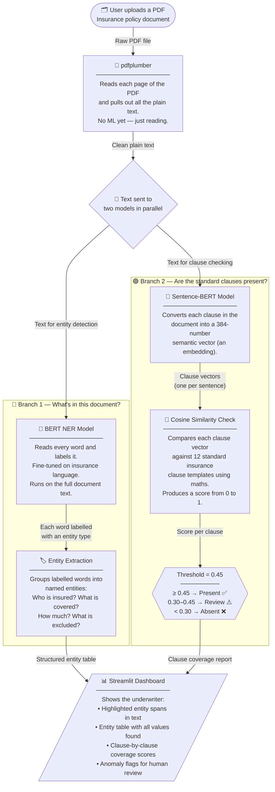
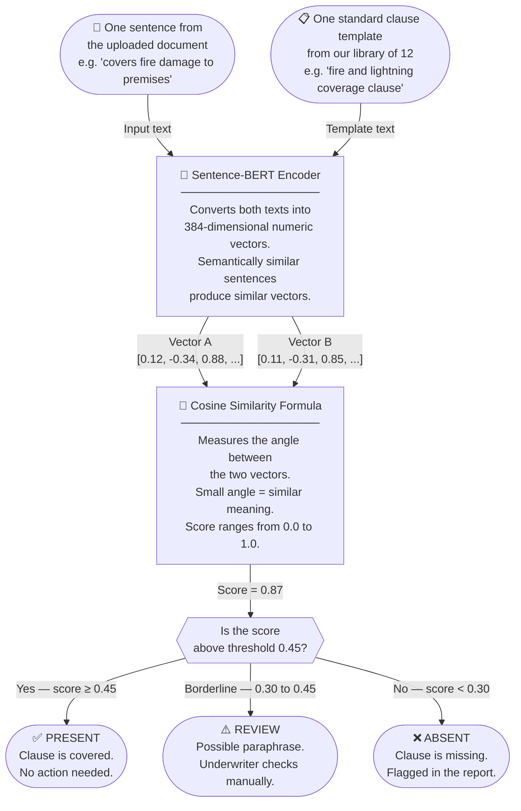

# 🧾 Insurance Document Intelligence System

> An end-to-end NLP pipeline that ingests insurance policy PDFs, extracts key entities using fine-tuned BERT, detects missing clauses via sentence-transformer cosine similarity, and presents results through an interactive Streamlit dashboard.

<p align="left">
  
  
  
  
  
</p>

---

## The Problem

Insurance underwriters manually process hundreds of policy documents to check coverage completeness. This is slow, error-prone, and expensive.

**This system automates two things:**
1. **Entity extraction** — finding who is insured, what's covered, premiums, dates, exclusions, and payout limits
2. **Clause verification** — checking whether a document contains all 12 standard insurance clauses, and flagging gaps for human review

---

## End-to-End Pipeline

> How the system processes a policy document from upload to final report — every box is a distinct stage with a clear role.



---

## Clause Similarity — How the Score Is Decided

> This diagram shows exactly what happens inside Branch 2 for a single clause comparison.



---

## Two Models, Two Jobs

| Component | Model | What it does |
|---|---|---|
| Named Entity Recognition | `bert-base-uncased` (fine-tuned) | Labels each word in the document with one of 6 entity types |
| Clause Similarity | `all-MiniLM-L6-v2` | Converts clauses to 384-dim vectors; computes cosine similarity against 12 standard templates |

---

## Entity Types

The NER model detects 6 entity types from policy text:

| Entity | What it captures | Example |
|---|---|---|
| `INSURED` | Name of the insured party | `"Tata Motors Limited"` |
| `COVERAGE` | What is covered | `"Fire"`, `"Flood"`, `"Earthquake"` |
| `PREMIUM` | Amount paid | `"Rs. 18,750"` |
| `POLICY_DATE` | Policy start/end dates | `"01/04/2024"` |
| `EXCLUSION` | What is explicitly NOT covered | `"spontaneous combustion"` |
| `POLICY_LIMIT` | Maximum payout amount | `"Rs. 50,00,000"` |

**What highlighted output looks like:**

> `[Tata Motors Limited]`<sub>INSURED</sub> hereby insures against `[Fire and Flood]`<sub>COVERAGE</sub> for a premium of `[Rs. 18,750]`<sub>PREMIUM</sub> with effect from `[01/04/2024]`<sub>POLICY_DATE</sub> excluding `[spontaneous combustion]`<sub>EXCLUSION</sub> up to `[Rs. 50,00,000]`<sub>POLICY_LIMIT</sub>.

---

## Evaluation Metrics

We use **F1-score per entity class**, not accuracy, because most tokens get labelled `O` (other). A model that labels everything as `O` would achieve ~85% accuracy while being completely useless. F1-score forces the model to actually find the entities that matter — and a missed `EXCLUSION` or `POLICY_LIMIT` is a high-stakes error.

### Overall Performance

| Metric | Score |
|---|---|
| Overall F1 | 0.3889 |
| Overall Precision | 0.3684 |
| Overall Recall | 0.4118 |
| Clause Coverage Detection | **86.7%** |

### Per-Class F1

| Entity | F1 Score | Notes |
|---|---|---|
| `POLICY_DATE` | **1.00** | |
| `EXCLUSION` | **0.40** | |
| `INSURED` | **0.29** | |
| `POLICY_LIMIT` | **0.29** | |
| `COVERAGE` | 0.00 | ⚠️ See note below |
| `PREMIUM` | 0.00 | ⚠️ See note below |

> **Why did COVERAGE and PREMIUM score 0.0?**
> Neither entity appeared in the 12 evaluation sentences used for this eval split. This is a **data distribution problem, not a model problem**. With only 60 labeled training samples split across 6 entity types, some classes simply don't appear in every evaluation partition. The solution is more labeled data — not a different model.

---

## Setup

### Requirements

- Python 3.10
- conda (recommended)

### Installation

```bash
# 1. Create and activate environment
conda create -n insurance-nlp python=3.10 -y
conda activate insurance-nlp

# 2. Install dependencies
pip install -r requirements.txt

# 3. Launch the dashboard
streamlit run app.py
```

### Core Dependencies

```
transformers          # BERT fine-tuning and inference
sentence-transformers # Sentence-BERT clause similarity
pdfplumber            # PDF text extraction
streamlit             # Interactive dashboard
numpy
pandas
torch
```

---

## Project Structure

```
insurance-intelligence/
├── app.py                      # Streamlit dashboard
├── requirements.txt
├── README.md
├── data/
│   ├── *.pdf                   # Insurance policy PDFs
│   ├── parsed_docs.json        # Extracted text from PDFs
│   └── labeled_data.json       # 60 labeled NER training samples
├── models/
│   └── bert-insurance-ner/
│       └── best/               # Fine-tuned BERT weights
└── utils/
    ├── pdf_parser.py           # PDF text extraction logic
    ├── similarity.py           # Sentence-BERT clause similarity checker
    ├── train_ner.py            # BERT fine-tuning script
    └── evaluate.py             # Evaluation report generator
```

---

## Known Limitations

| Limitation | Detail |
|---|---|
| Small training set | 60 labeled samples — production use needs 500+ |
| No OCR support | Scanned or image-based PDFs are not supported |
| Threshold tuning | Cosine threshold of 0.45 was tuned on Standard Fire & Special Perils documents only |
| No table parsing | Tables embedded inside PDFs are not yet extracted |

---

## Roadmap

- [ ] OCR integration for scanned PDFs (Tesseract / Azure Form Recognizer)
- [ ] Expand training data to 500+ labeled samples across all entity types
- [ ] Per-policy-type threshold calibration
- [ ] Table-aware extraction using layout models (e.g. LayoutLM)
- [ ] REST API wrapper for integration with underwriting platforms

---

## Research Context

Built as part of an applied NLP internship focused on document intelligence pipelines. Presented alongside related AI gait-analysis research at **ABILITY EXPO (IFNR)** to 300+ clinicians.

---

<p align="center">
  <em>Turning unstructured policy documents into measurable, auditable coverage reports.</em>
</p>
